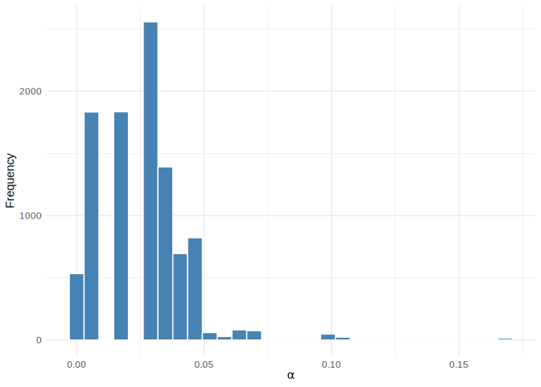
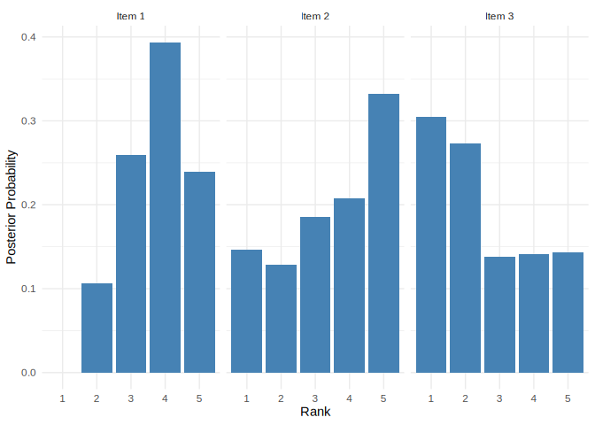

<!-- README.md is generated from README.Rmd. Please edit that file -->

# BayesMallowsSMC2

<!-- badges: start -->

[](https://github.com/osorensen/BayesMallowsSMC2/actions/workflows/R-CMD-check.yaml)
<!-- badges: end -->

BayesMallowsSMC2 provides functions for performing sequential inference
in the Bayesian Mallows model using the SMC2 algorithm (Sørensen et al.
2025).

## Installation

You can install the development version of BayesMallowsSMC2 from
[GitHub](https://github.com/) with:

``` r
# install.packages("devtools")
devtools::install_github("osorensen/BayesMallowsSMC2")
```

## Example

Here is a basic example using the included `complete_rankings` dataset:

``` r
library(BayesMallowsSMC2)

# Fit the model with complete rankings
set.seed(123)
mod <- compute_sequentially(
  complete_rankings,
  hyperparameters = set_hyperparameters(n_items = 5),
  smc_options = set_smc_options(n_particles = 100, n_particle_filters = 1)
)

# Show model info
mod
#> BayesMallowsSMC2 Model
#> ======================
#> 
#> Number of particles:      100
#> Number of timepoints:     100
#> Number of items:          5
#> Number of clusters:       1
#> 
#> Log marginal likelihood:  -472.34
#> Final ESS:                63.55
#> Resampling events:        5/100
```

### Posterior Summaries

We can visualize the posterior distributions of the parameters:

``` r
# Posterior distribution of alpha (dispersion parameter)
plot(mod, parameter = "alpha")
```



``` r
# Posterior distribution of rho (ranking positions)
plot(mod, parameter = "rho", items = c(1, 2, 3))
```



## References

<div id="refs" class="references csl-bib-body hanging-indent"
entry-spacing="0">

<div id="ref-10.1214/25-BA1564" class="csl-entry">

Sørensen, Øystein, Anja Stein, Waldir Leoncio Netto, and David S.
Leslie. 2025. “<span class="nocase">Sequential Rank and Preference
Learning with the Bayesian Mallows Model</span>.” *Bayesian Analysis*,
1–26. <https://doi.org/10.1214/25-BA1564>.

</div>

</div>
