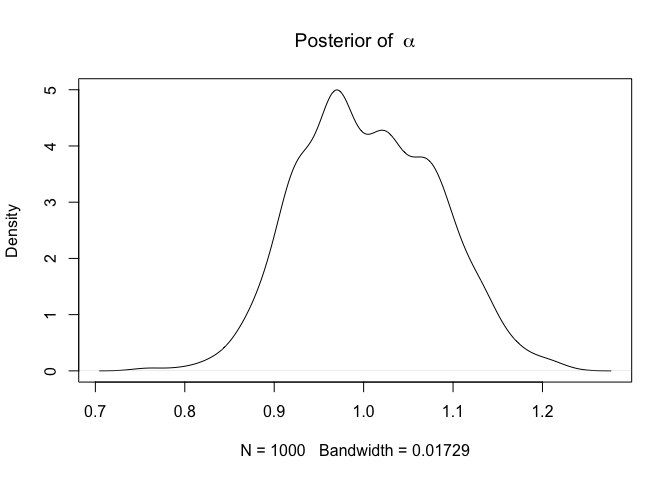

<!-- README.md is generated from README.Rmd. Please edit that file -->

# BayesMallowsSMC2

<!-- badges: start -->

[](https://github.com/osorensen/BayesMallowsSMC2/actions/workflows/R-CMD-check.yaml)
<!-- badges: end -->

BayesMallowsSMC2 provides functions for performing sequential inference
in the Bayesian Mallows model using the SMC$^{2}$ algorithm originally
developed by Chopin, Jacob, and Papaspiliopoulos
([2012](#ref-Chopin2012)) and Fulop and Li ([2013](#ref-Fulop2013)). The
methodology implemented is described in Sørensen et al.
([2024](#ref-Sorensen2024)). The package supports analysis of time
series containing complete rankings, partial rankings, and pairwise
preference data, and all of these data types can be combined with
mixture modeling.

## Installation

You can install the development version of BayesMallowsSMC2 from GitHub
with:

``` r
# install.packages("devtools")
devtools::install_github("osorensen/BayesMallowsSMC2")
```

## Usage

``` r
library(BayesMallowsSMC2)
```

The example dataset `complete_rankings` contains a simulated dataset in
which 100 users have provided a complete ranking of five items at 100
separate timepoints. The first six rows are shown below.

``` r
head(complete_rankings)
#>   timepoint user item1 item2 item3 item4 item5
#> 1         1    1     1     2     3     5     4
#> 2         2    2     2     1     3     4     5
#> 3         3    3     1     2     3     4     5
#> 4         4    4     1     2     3     4     5
#> 5         5    5     1     2     3     5     4
#> 6         6    6     1     2     3     4     5
```

We can analyze these data sequentially using the
`compute_sequentially()` function. Since the rankings are complete, we
only need a single particle filter in this case. Otherwise we use the
default options.

``` r
model <- compute_sequentially(
  data = complete_rankings,
  hyperparameters = set_hyperparameters(n_items = 5),
  smc_options = set_smc_options(n_particle_filters = 1, 
                                max_particle_filters = 1)
)
```

No plotting function is implemented yet, but the posterior can be
inspected by plotting the elements of the returned `model` object.

``` r
plot(density(model$alpha), main = expression("Posterior of " ~ alpha))
```



## References

<div id="refs" class="references csl-bib-body hanging-indent"
entry-spacing="0">

<div id="ref-Chopin2012" class="csl-entry">

Chopin, N., P. E. Jacob, and O. Papaspiliopoulos. 2012. “SMC2: An
Efficient Algorithm for Sequential Analysis of State Space Models.”
*Journal of the Royal Statistical Society Series B: Statistical
Methodology* 75 (3): 397–426.
<https://doi.org/10.1111/j.1467-9868.2012.01046.x>.

</div>

<div id="ref-Fulop2013" class="csl-entry">

Fulop, Andras, and Junye Li. 2013. “Efficient Learning via Simulation: A
Marginalized Resample-Move Approach.” *Journal of Econometrics* 176 (2):
146–61. <https://doi.org/10.1016/j.jeconom.2013.05.002>.

</div>

<div id="ref-Sorensen2024" class="csl-entry">

Sørensen, Øystein, Anja Stein, Waldir Leoncio Netto, and David S.
Leslie. 2024. “Sequential Rank and Preference Learning with the Bayesian
Mallows Model.” arXiv. <https://doi.org/10.48550/ARXIV.2412.13644>.

</div>

</div>
